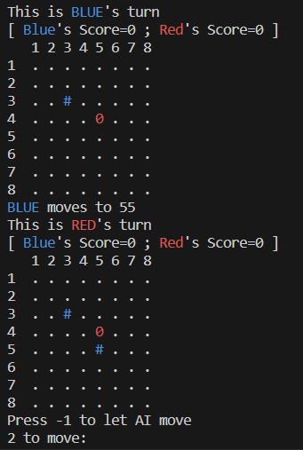
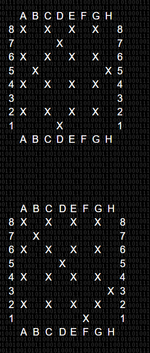

# ESTR-MetaSquares - The Unbeatable AI (Maybe)



A console-based AI for MetaSquares, a two-player game originally created by Scott Kim. This project was developed for the ESTR1002 course at CUHK.

The AI uprising is here, and it starts with MetaSquares. 🤖

## 🚀 How to build and run

1. Execute the build task defined in tasks.json.
1. Execute the run task defined in tasks.json.

It should be noted that the build task, by default, has `-DR_LOCAL` defined, which means that the program will run in local debug mode. To run the program in production mode, remove `-DR_LOCAL` from the build task.

## 🎮 How to play

1. This program was tested on Python 3.12.0.
1. Choose a game mode: 1 for human vs human, 2 for human vs AI, 3 for AI vs Human.
1. To make a move, enter the coordinates of the piece you want to place in the format `xy`, where x is the row number and y is the column number. For example, to place a piece at the bottom-left corner, enter `81`.
1. Players take turns placing a piece on the board. Blue goes first because, well, someone has to.
1. Players earn points when they form the four corners of a square. The score is calculated by the area of the square. The squares can also be slanted, like your life choices.
1. The game ends when a player scores more than 150 points and has at least 15 points more than the other player, or when the board is full.
1. You can read the rules further online if you want, or don't; I am not your mom.

## 💪 How to train the AI

1. Install the dependencies by running `pip install -r requirements.txt`.
1. Make necessary changes to `config.py` to configure the training process.
1. This project was configured to run on Google Compute Engine. The machine I used was `c2d-highcpu-8`. As of now, Google Compute provides $300 __free__ credits for new users. Yay.
1. Run `start.sh` on your Bash terminal to start the training process.
1. The program logs the training progress to Google Logging, so you can keep track using the Google Cloud app. If you want, you can also set up logging alerts to notify you when the training is complete for a generation. Here are the log queries I used:

    ```text
    resource.type="gce_instance"
    log_name="projects/{YOUR-PROJECT-NAME}/logs/Genetic_AI"
    textPayload=~"GENERATION (\d+) COMPLETE"
    ```

    ```text
    resource.type="gce_instance"
    log_name="projects/{YOUR-PROJECT-NAME}/logs/Genetic_AI"
    textPayload=~"GENERATION (\d+) STARTED"
    ```

    ```text
    resource.type="gce_instance"
    log_name="projects/{YOUR-PROJECT-NAME}/logs/Genetic_AI"
    severity="ERROR"
    ```

1. Each generation dataset is dumped to the `./training_data` folder. A `stats.log` file is also created, showing a sorted score of the AIs in the generation.
1. To load a particular generation and resume training, change `START_GENERATION` in `config.py` to the generation number you want to load. The program will automatically load the most recent dump of that generation. At no point are the dumps ever overwritten. If you want to use an older training of the same generation, you can rename the recent dump, move it to another folder, or delete it. The last file in the below code is loaded:

    ```python
    files = sorted(
            Path.glob(
                Path(config.TRANING_LOCATION),
                "gen_{}_dataset_[0-9]*.pickle".format(gen),
            )
        )
    ```

1. A `restart.bool` file is also created when training starts. Changing the value of this file to `true` will restart the program after the current generation is complete. This is useful if you made changes to the repo and you want to update it when the generation ends, which can sometimes happen when you are asleep. This script resets and pulls the latest changes from the Git repo, so make sure you commit your changes you want to keep before restarting.

1. To see the win-loss table, execute the `Visualize.py` script to visualize the training dump. The dump specified in `config.py` will be visualized.

## 🧠 AI strategies

### 1. 🤏 Minimax

Minimax is a recursive algorithm used to find the best move for a player, assuming that the opponent plays optimally. It is a depth-first search algorithm that searches the entire game tree. As MetaSquares is a very complex game, one must imagine Sisyphus calculating ~64! possible games. Thus, we limit how far we search into the game by defining a `maxDepth`.

### 2. 🧑‍🌾 Alpha-beta pruning

Alpha-beta pruning is an optimization to the minimax algorithm. It prunes unnecessary branches in the game tree using a garden trimmer. I would suggest this [video](https://www.youtube.com/watch?v=l-hh51ncgDI) by Sebastian Lague to learn more.

### 3. 📈 Heuristics

Heuristics are used to evaluate the board state. Each move is assigned a score based on the board state. Moves are then sorted by their score during the minimax algorithm, making the AB pruning more effective. Additionally, a strong heuristic allows the minimax algorithm to operate with a smaller branching factor, enabling deeper exploration of the game tree. (Branching factor is the number of moves evaluated at each node in the game tree) The following sections will explain the heuristics used in this project.

#### 3.1 Possible Squares

This heuristic evaluates the number of possible squares that can be formed by the current player for each move. The opponents' pieces are excluded from the calculation. The more possible squares that can be formed by a move, the better.

#### 3.2 Possible Score

This heuristic evaluates the score of all possible squares that can be formed by the current player for each move. The opponents' pieces are excluded from the calculation. The higher the score of the possible squares that can be formed by a move, the better.

#### 3.3 Pattern Squares

This heuristic uses a mathematically proven pattern that gives the highest score in 20-24 moves of one player. Most games don't go on for that long. The research paper I used can be found [here](https://www.researchgate.net/publication/243112654_How_to_play_MetaSquares). In summary, a lattice structure of moves gives the highest score. Below is an illustration of the pattern:



The image was collected from [anysquare.de](https://web.archive.org/web/20031019194553/http://www.anysquare.de/), which was mentioned in the research paper but has long been taken down. The image was collected using the Wayback Machine.

This heuristic calculates the number of squares that can be formed by the current player for each move in the pattern. The more squares that can be formed by a move, the better. The pattern is rotated to get the best score.

#### 3.4 Pattern Score

This heuristic calculates the score of the squares that can be formed by the current player for each move in the pattern. The higher the score of the squares that can be formed by a move, the better. The pattern is rotated to get the best score.

#### 3.5 My Squares

This heuristic calculates the squares that can be formed using existing pieces. The score is the number of pieces of the square already on the board, squared. i.e., if a square has 3 pieces completed and 1 piece missing, the missing piece gets a score of 9.

#### 3.6 My score

This heuristic calculates the score of the squares that can be formed using existing pieces. The score is the score of the possible square, multiplied by the number of pieces of the square already on the board. i.e., if a square has 2 pieces completed and 2 pieces missing, and the area of the possible square is 4, the two missing pieces get a score of 4*2=8.

#### 3.7 Opponent Squares

Same as above but for the opponent.

#### 3.8 Opponent Score

Same as above but for the opponent.

#### 3.9 Killer Heuristics

This heuristic is assigned when searching the game tree. Each score found calculated by the minimax algorithm is assigned to a table. The table can later be used to sort the moves. This is useful because the moves that have been deterministically calculated to have high scores can be evaluated before the "possible" good moves as calculated by the normal heuristics from above.

#### 3.10 Killer Decay Constant

This constant is used to decay the killer heuristics table. The table is decayed by multiplying each score by this constant. This ensures that consistently good moves receive a high score, while moves that are good only in certain situations receive a lower score.

#### 3.11 Depth

This is the depth of the minimax algorithm. The higher the depth, the more moves are evaluated. A high depth means the AI plays like [Hikaru](https://youtube.com/shorts/tO7eSxWWHqM?si=7m0zwGUKsAxl7jdL).

#### 3.12 Dlogb Constant

This is the time constant. The complexity of the bottleneck (the minimax algorithm) is O(b^d), where b is the branching factor and d is the depth. Decreasing this constant means that the AI will take less time to make a move, but it also means it will evaluate fewer moves.

### 4. 🧬 Genetic Algorithm

The genetic algorithm is used to train the AI. The AI is represented by a list of weights, indicating the importance of each heuristic. The genetic algorithm finds the best weights for the AI. I suggest watching the two video series by Code Bullet to better understand this algorithm: [Part 1](https://www.youtube.com/watch?v=VnwjxityDLQ) and [Part 2](https://www.youtube.com/watch?v=BOZfhUcNiqk).

## 🏃‍♂️ Performance

The AI has been tested against the following AIs:

1. [Pencil and Paper Games MetaSquares AI](http://www.papg.com/article?35AM)
1. [Metasquarer build 73](https://www.metasquared.com/msquarer/download.shtml)
1. [AnySquare 0.925](https://web.archive.org/web/20051229192854/http://www.dbs.uni-hannover.de/~makoui/AnySquare.html) - collected from the Wayback Machine
1. [MetaGenius](https://www.metasquared.com/play.shtml) - using default settings. I am not entirely sure how the program works; it seems that you can train the AI in this program. So it may not be a fair comparison as the AI may not be trained.
1. [Squares - The New MetaSquares Game](https://apps.apple.com/us/app/squares-the-new-metasquares-game/id1059591757)

These are all the AIs that I was able to find, and my AI beat all of them every time. I also placed first in the AI tournament held by the course :)

## 🔮 Future of the Project

This AI is nowhere near perfect and is definitely beatable, but it is already very strong and beat all of the AIs I was able to find. So it may be safe to say that it is currently the best AI to date (because the rest are outdated due to a lack of popularity of the game hehe). You may try to beat it yourself and let me know if you are able to do so :) Feel free to open an issue or make pull requests if you have any questions or suggestions. I personally will probably not be working on this project anymore, but I will try to answer any questions you may have.
